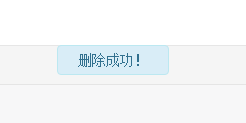
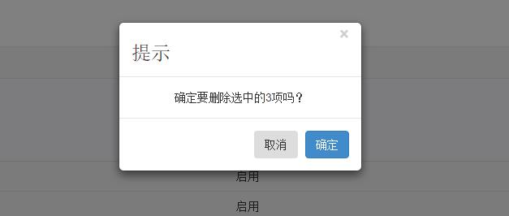

## 系统集成脚本
**主要将后台常用的函数进行了封装**整个对象win并放在了全局对象windown中，方便可页面使用。[main.js源代码](https://github.com/Aierui/web/blob/master/public/js/admin/main.js)

[TOC=2,3]

### 初始化selector
~~~
win.init(selector)
~~~
| 参数   | 含义   |
| --- | --- |
|  selector  | html标签  |

#### 空对象判断
~~~
win.empty()
~~~

#### 重定向
~~~
win.redirect(url, time)
~~~
| 参数   | 含义   |
| --- | --- |
|  url  | 需要跳转到的地址  |
|  time  | 跳转等待时间  |

#### modal
~~~
win.modal(url)
~~~
| 参数   | 含义   |
| --- | --- |
|  url  | 一般是视图view中的模板文件  |

#### 全局ajax请求
~~~
win.globalAjax() 
~~~
初始化时会全局开启，将返回的json格式数据。

#### 下载js
~~~
win.getScript(url , fn)
~~~
| 参数   | 含义   |
| --- | --- |
|  url  | 引进脚本资源地址（绝对路径、相对路径均可）   |
|   fn  | 资源返回成功回调函数 |

#### 下载样式
~~~
win.getStyle(url)
~~~
| 参数   | 含义   |
| --- | --- |
|  url  | 引进脚本资源地址（绝对路径、相对路径均可），放在hand标签中  |

#### 表单验证
~~~
win.validate(object)
~~~
| 参数   | 含义   |
| --- | --- |
|  object  | html结构元素  |

### jquery扩展ajax提交表单

### 弹出提示信息alertMsg(content, time)
~~~
alertMsg(content, time)
~~~
| 参数   | 含义   |
| --- | --- |
|  content  | 提示信息的内容  |
|  time  |	显示持续的时间，默认一切提示信息都是3s  |

提示框效果

### 弹出确认提示框alertConfirm()等
~~~
alertConfirm(option) 
~~~
借助bootstrap中模态框将确认提示框封装，对象option的参数有：
| 参数 |类型  | 含义   | 默认| 
| --- | --- | --- |---|
|  title | string  | 提示标题 | 提 示   |
|  content |  string  | 提示内容，如 确定要删除选中的3项吗？  |   |
|  okValue | string  | 确定按钮的文本|  确定  |
|  ok   | function  | 确定调用的方法   |    |
|  cancelValue | string   | 取消按钮的文本|   取消 |
|  cancel  | function |  取消调用的方法 |    |
|  backdrop |  boolean  | 默认自动生成一个 .modal-backdrop 元素用于提供一个可点击的区域，点击此区域就即可关闭模态框。  | true   |

效果如图

